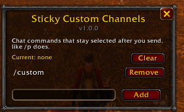
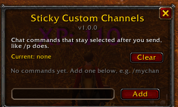
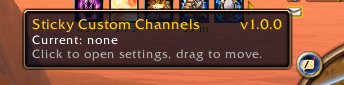
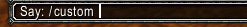

# Sticky Custom Channels

Makes addon chat commands stay selected after you send a message, the way
`/p`, `/g` and `/raid` do. Built for **WoW Forever** (client 1.60.1,
interface 16001). The TOC also lists 11508 and 120100.

## Why

WoW only remembers built-in chat types. Chat "channels" added by addons are
plain slash commands, so after you send one the chat box goes back to Say or
whatever built-in channel you used last.

## What it does

- **Remembers your custom channel.** After you send a message with a command
  from your list, the next time you open chat (Enter) the box already starts
  with that command, e.g. `/mychan `. The choice is saved across reloads and
  relogs.
- **Gets out of the way.** With `/mychan ` filled in, typing another command
  (`/p`, `/w Name`, `/dance`...) removes the `/mychan ` so the new command
  works.
  Sending a normal message in a built-in channel turns the sticky command off,
  just like switching from `/p` to `/g`.
- **Leaves prefilled text alone.** If something else opens chat with text
  already in it (reply to a whisper, `/w` from a menu), nothing is added.
- **Your own list.** No commands are sticky by default. Add the ones you use
  in the settings window.

## Screenshots








## Usage

- **Minimap button:** click it to open settings, drag it to move it around
  the minimap. The tooltip shows the current sticky command.
- **Settings window:**
  - Type a command in the box at the bottom and click **Add** or press Enter.
    The leading `/` is optional.
  - **Remove** next to a command takes it off the list.
  - **Clear** turns off the current sticky command.
- **Slash commands:**
  - `/scc` opens or closes the settings window.
  - `/scc minimap` hides or shows the minimap button.

## How it works

The addon hooks the chat edit boxes and never replaces Blizzard's own chat
code or the other addon's slash handler.

- `OnTextChanged` keeps track of the last non-empty text in the box, and strips
  the sticky prefix when you start typing a different command.
- `OnEnterPressed` (post-hook) looks at what was sent. A message starting with
  a listed command makes that command sticky; a normal message clears it.
- `ChatFrame_OpenChat` / `ChatFrameUtil.OpenChat` (whichever exists) is hooked
  to prefill the command when chat opens empty. Blizzard sets the box text a
  frame later, so the addon sets the pending text as well as filling the box
  on the next frame.

Because the command is typed into the box as text, you see `/mychan ` in the
input rather than a coloured channel label like built-in channels have.

## Install

Download `StickyCustomChannels-<version>.zip` from the
[Releases](https://github.com/Snugglife/StickyCustomChannels/releases) page and
unzip it into your game's `Interface/AddOns/` folder, then restart the game.

Or put the `StickyCustomChannels` folder (with the `.toc`, `.lua`, `LICENSE`
and `media/` inside) into your game's `Interface/AddOns/` folder, then restart
the game.

## Files

- `StickyCustomChannels.toc` – addon metadata, saved variable
  `StickyCustomChannelsDB`.
- `StickyCustomChannels.lua` – chat hooks, settings window, minimap button,
  `/scc`.
- `media/` – in-game textures: `icon.tga` (addon list) and `minimap.tga`
  (minimap button).
- `art/` – icon sources. `icon.svg` and `icon-minimap.svg` are the originals;
  `icon.png` (512px, used in this README) and `icon-400.png` (CurseForge
  project avatar) are rendered from them.
- `LICENSE` – license terms, shipped inside the addon.
- `CHANGELOG.md` – what changed in each version.
- `package.sh` – builds the release zip.

## Versions and releases

The version lives in one place, `## Version:` in `StickyCustomChannels.toc`.
The addon reads it from there and shows it in the settings window title and
the minimap button tooltip. Versions follow `MAJOR.MINOR.PATCH`: bug fixes bump
the patch, new features the minor.

To make a release:

1. Bump `## Version:` in the `.toc` and add a section to `CHANGELOG.md`.
2. Commit, then build the zip with `./package.sh`. It lands in
   `dist/StickyCustomChannels-<version>.zip` with the `.toc`, `.lua`,
   `LICENSE` and `media/` inside a `StickyCustomChannels/` folder.
3. Tag and publish it:

   ```sh
   git tag v1.0.0
   git push origin v1.0.0
   gh release create v1.0.0 dist/StickyCustomChannels-1.0.0.zip --notes-file CHANGELOG.md
   ```

## License

[PolyForm Noncommercial 1.0.0](LICENSE). You can use, change and share this
addon for any noncommercial purpose. You can't sell it or use it commercially.

Required Notice: Copyright (c) 2026 Snugglife (https://github.com/Snugglife)

## Updating the icon

Edit `art/icon.svg` (and `art/icon-minimap.svg`, the same drawing without the
background tile), then re-render:

```sh
rsvg-convert -w 512 art/icon.svg -o art/icon.png
rsvg-convert -w 400 art/icon.svg -o art/icon-400.png
rsvg-convert -w 64 art/icon.svg | magick - -type TrueColorAlpha -compress None media/icon.tga
rsvg-convert -w 64 art/icon-minimap.svg | magick - -type TrueColorAlpha -compress None media/minimap.tga
```

New texture files only show up after a full game restart, not `/reload`.
